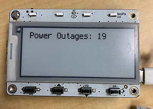

# MagTag_Power_Outage_Counter
Tracks the times power to the MagTag fails. Used to track how often the neighborhood power goes down. 
In my neighborhood, the power goes out when the wind blows. Each year there are probably 20 power outages. At least one a month. I wanted to keep track of the number of breaks in power. 

